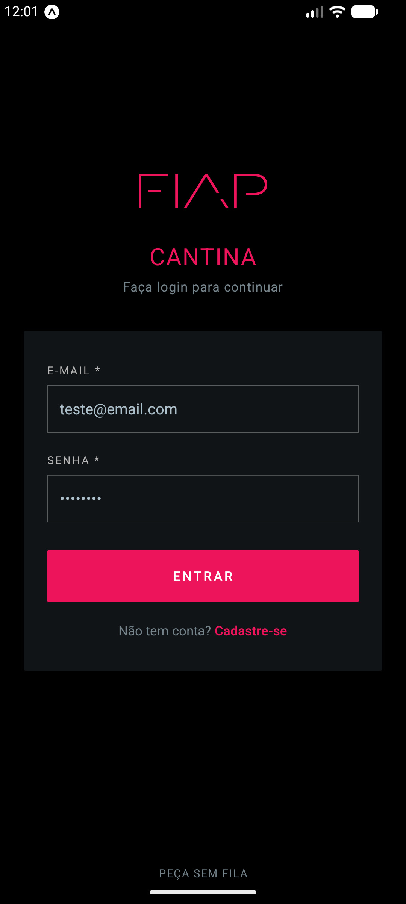
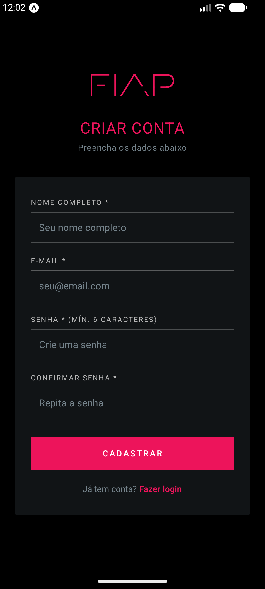
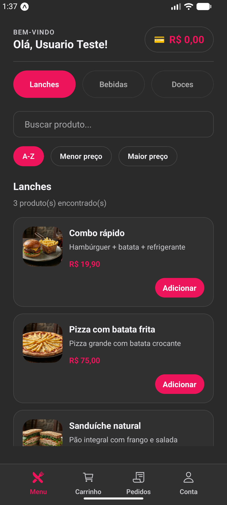
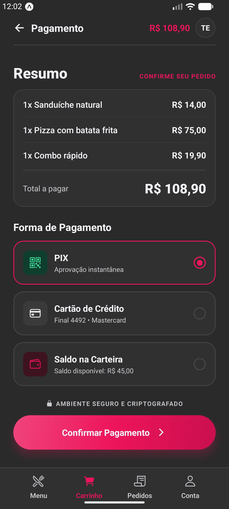
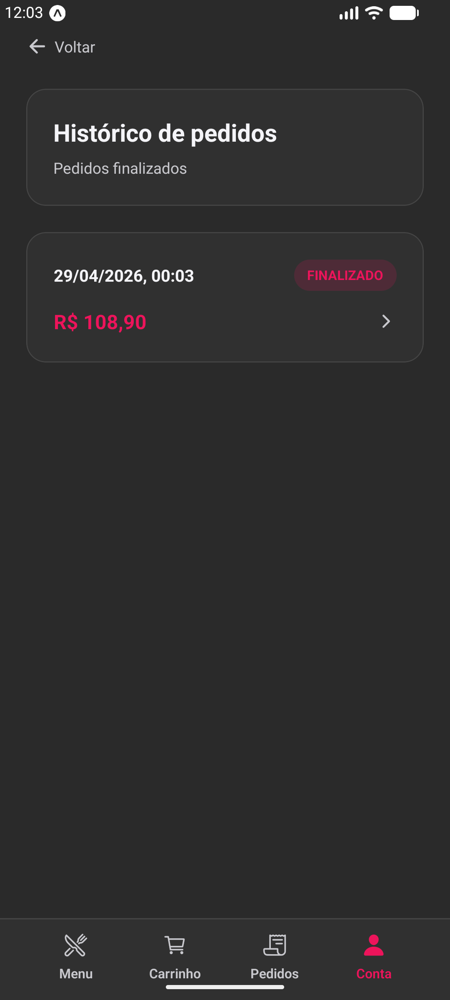
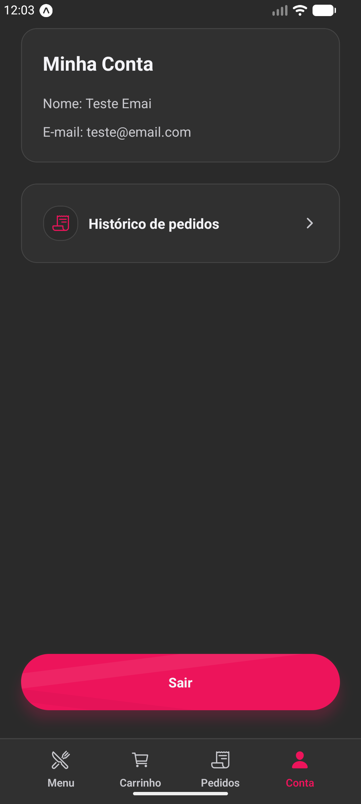
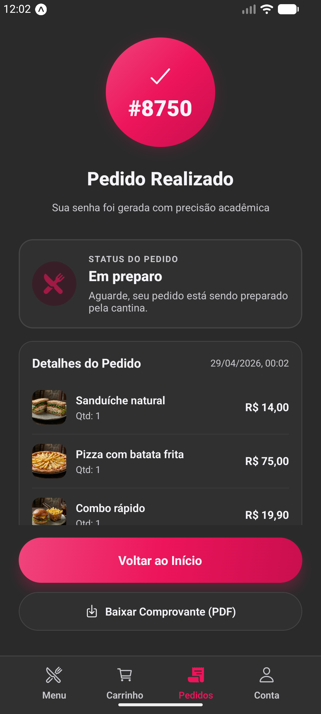
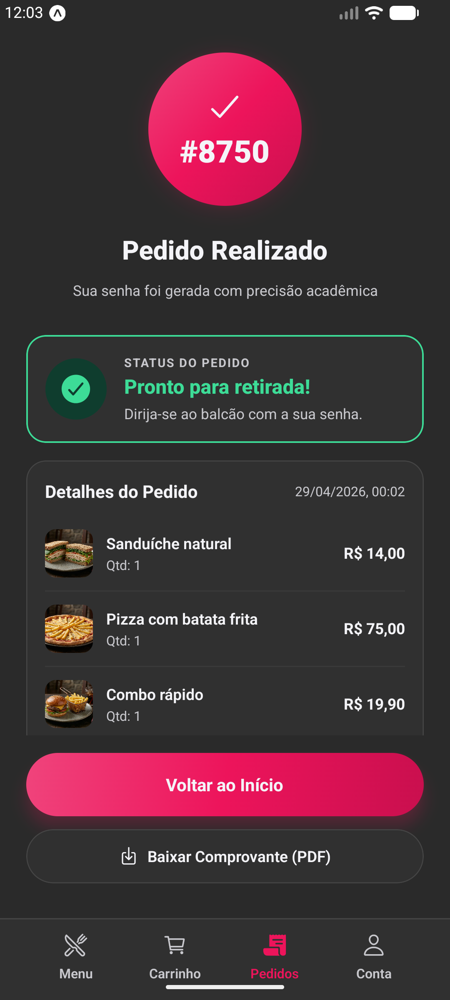
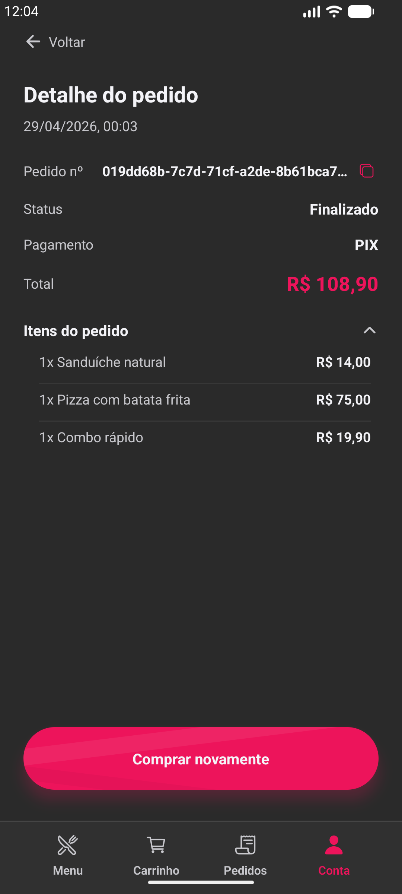

# Cantina FIAP

Aplicativo mobile desenvolvido para o **Checkpoint 2** da disciplina **Cross-Platform Application Development** — Ciência da Computação, 3º semestre (FIAP).

## Sobre o Projeto

A operação escolhida foi a **cantina da FIAP**. Nos horários de intervalo, a fila da cantina consome uma parte importante do tempo dos alunos. A proposta do app é permitir que o aluno monte o pedido, simule o pagamento, acompanhe o status e retire a compra usando uma senha, reduzindo espera e deixando o fluxo mais previsível.

No CP1, o projeto era um MVP com login simples, cardápio, carrinho, pagamento simulado e tela final de retirada. No CP2, o app foi evoluído para um fluxo mais próximo de produto real, com autenticação persistida, cadastro, sessão, histórico de pedidos, status de preparo, notificações locais e melhoria geral de UX.

## Tecnologias Usadas

Este projeto foi desenvolvido utilizando as seguintes tecnologias:

- React Native
- Expo SDK 54
- Expo Router
- JavaScript
- AsyncStorage
- Context API
- Expo Notifications
- Expo Print
- React Hooks (useState, useEffect, useContext)
- StyleSheet

## O que mudou em relação ao CP1

Comparando o estado atual com o commit final do CP1 (`7a5b6d3`), as principais evoluções foram:

- Autenticação real local com **cadastro**, **login**, **logout** e sessão persistida.
- Substituição do login antigo com RM/nome por e-mail e senha salvos no `AsyncStorage`.
- Criação das rotas `app/auth/login.js` e `app/auth/register.js`.
- Reorganização das telas principais dentro de `app/tabs/`.
- Persistência do histórico funcional de pedidos com `AsyncStorage`.
- Nova tela de **histórico de pedidos**.
- Nova tela de **detalhe de pedido finalizado**.
- Cardápio evoluído com busca por texto, ordenação e listagem performática.
- Status visual do pedido: em preparo e pronto para retirada.
- Notificações locais para avisar andamento e retirada do pedido.
- Geração e compartilhamento de comprovante em PDF.
- Footer com navegação por ícones usando `@expo/vector-icons`.
- Uso de `uuid` para identificar pedidos.
- Melhorias nos feedbacks visuais: loading, estados vazios, erro inline, sucesso e botões desabilitados.

## Funcionalidades

- Cadastro de usuário com nome, e-mail, senha e confirmação de senha.
- Login validando credenciais persistidas localmente.
- Sessão persistida para manter o usuário logado ao reabrir o app.
- Logout com limpeza da sessão, carrinho e pedidos em memória.
- Cardápio por categorias, com imagens e controle de quantidade.
- Busca em tempo real no cardápio por nome ou descrição do produto.
- Ordenação do cardápio por A-Z, menor preço e maior preço.
- Estado vazio no cardápio quando nenhum produto corresponde à busca.
- Carrinho integrado ao fluxo de pagamento.
- Pagamento simulado com seleção de forma de pagamento.
- Geração de senha de retirada.
- Tela de pedido em andamento com status de preparo.
- Notificação local quando o pedido entra em preparo e quando fica pronto.
- Histórico de pedidos finalizados persistido.
- Detalhe de pedido histórico com itens, total, status e forma de pagamento.
- Comprovante em PDF com compartilhamento pelo dispositivo.
- Navegação com Expo Router.
- Estado global com Context API.

## Integrantes

- Helena Barbosa Costa - RM:562450
- Henrique Mandrick - RM:562715
- Mateus Scandiuzzi Valente Tomomitsu - RM:561565
- Ryan Amorim de Castro Santana - RM:564393
- Thomas Joh Kobayashi - RM:562758

## Como Rodar

### Pré-requisitos

- [Node.js](https://nodejs.org/) v18 ou superior, recomendado v20 LTS.
- [Git](https://git-scm.com/) instalado.
- Expo SDK 54, conforme `package.json`.
- [Expo Go](https://expo.dev/go) no celular ou Android Studio com emulador configurado.

### Passo a passo

```bash
git clone https://github.com/Matomomitsu/fiap-cpad-cp2-cantina-app.git
cd fiap-cpad-cp2-cantina-app
npm install
npx expo start
```

Depois de iniciar, escaneie o QR Code com o **Expo Go** ou pressione `a` para abrir no emulador Android.

## Demonstração Visual


| Login | Cadastro | Cardápio |
|:-----:|:--------:|:--------:|
|  |  |  |

| Carrinho | Histórico | Conta |
|:--------:|:---------:|:-----:|
|  |  |  |

| Pedido em preparo | Pedido pronto | Detalhe do Histórico |
|:-----------------:|:-------------:|:---------:|
|  |  |  |

### Vídeo demonstrativo

[](https://www.youtube.com/shorts/-Vw0oCdfH1s)

## Decisões Técnicas

### Estrutura do projeto

```text
app/                    Rotas do Expo Router
app/auth/               Telas de login e cadastro
app/tabs/               Telas autenticadas do fluxo principal
components/             Componentes reutilizáveis
contexts/               Estado global com Context API
services/               Serviços de autenticação e notificações
styles/                 Tema visual centralizado
utils/                  Funções utilitárias de preço e pedido
assets/images/          Imagens do cardápio e prints do README
```

### Context API

- `UserContext`: armazena o usuário logado, o estado de carregamento da sessão, `setUser` e `logout`.
- `CartContext`: armazena os itens selecionados no carrinho.
- `OrderContext`: armazena o pedido ativo, o histórico de pedidos e funções para iniciar ou limpar pedidos.

### AsyncStorage

O app usa `AsyncStorage` para persistir dados locais sem backend:

- `@cantina-fiap/users`: lista de usuários cadastrados.
- `@cantina-fiap/session`: sessão do usuário logado.
- `@cantina-fiap/order-history`: histórico de pedidos finalizados.

A sessão é restaurada no `UserContext` usando `useEffect`. O histórico é carregado ao montar o `OrderContext` e salvo novamente sempre que a lista muda.

### Autenticação

O cadastro normaliza o e-mail, valida duplicidade e salva o usuário no `AsyncStorage`. O login consulta os usuários persistidos e só permite entrada quando e-mail e senha conferem. Ao autenticar, a sessão é salva e o usuário é redirecionado para o cardápio.

### Navegação protegida

A rota inicial `app/index.js` funciona como porteiro do app: enquanto a sessão é carregada, mostra `ActivityIndicator`; se existe usuário logado, redireciona para `/tabs/cardapio`; se não existe sessão, redireciona para `/auth/login`. O logout limpa a sessão e retorna para o login com `router.replace`.

### Validação de formulários

Os formulários usam `useState`, funções de validação e feedback inline. No login, os erros aparecem abaixo do campo correspondente, em vermelho, e o botão de submissão fica desabilitado enquanto e-mail ou senha estão inválidos.

### Cardápio, busca e filtros

O cardápio foi evoluído no commit `64b01e5` para usar `FlatList` no lugar de uma lista renderizada por `ScrollView`, deixando a tela mais adequada para crescimento do menu. A tela agora mantém estados locais para categoria, busca e ordenação, e usa `useMemo` para recalcular a lista visível apenas quando esses filtros mudam.

A busca compara o texto digitado com o nome e a descrição dos produtos. A ordenação permite alternar entre A-Z, menor preço e maior preço. Quando a categoria muda, a lista volta para o topo, e quando nenhum item atende aos filtros, o app mostra um estado vazio em vez de deixar a tela sem resposta.

### Pedido, histórico e comprovante

Ao confirmar o pagamento, o app cria um registro de pedido com senha de retirada, total, forma de pagamento, itens e status. Quando um novo pedido é iniciado, o pedido anterior é finalizado e entra no histórico persistido. A tela final também permite gerar um comprovante em PDF usando `expo-print` e compartilhar o arquivo com `expo-sharing`.

## Diferencial Implementado

O diferencial principal escolhido foi **notificações locais com Expo Notifications**.

### Justificativa

Esse diferencial combina diretamente com o problema da cantina: o aluno não precisa ficar olhando a tela para saber se o pedido está pronto. A notificação transforma o fluxo em algo mais útil no uso real, porque o aluno pode aguardar em outro lugar e voltar ao balcão quando receber o aviso.

### Como foi implementado

O serviço `services/notificationService.js` centraliza permissões, canal Android e agendamento. Na confirmação do pagamento, a tela agenda notificações para o pedido em preparo e para o pedido pronto. A tela de pedido final também dispara a notificação de pronto quando detecta a transição de status.

Além disso, a tela de pedido final usa `Animated API` para reforçar visualmente o status do pedido, com pulso durante preparo e animação quando fica pronto.
